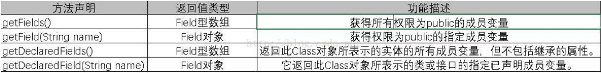
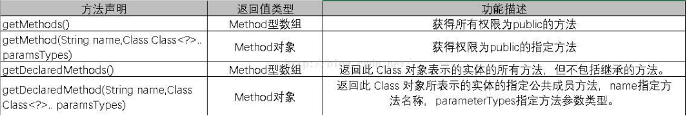
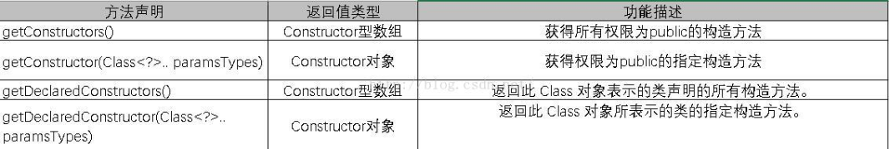
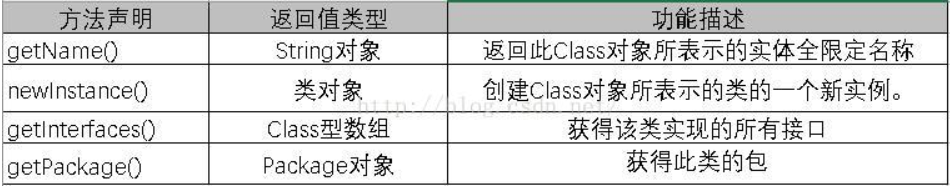

<!-- @import "[TOC]" {cmd="toc" depthFrom=1 depthTo=6 orderedList=false} -->
<!-- code_chunk_output -->

* [1.反射：](#1反射)
* [2.主要功能：](#2主要功能)
	* [通过反射获取类的是三种方式](#通过反射获取类的是三种方式)
* [3.通过反射可以获取到的主要描述信息](#3通过反射可以获取到的主要描述信息)
	* [3.1 获得属性：](#31-获得属性)
	* [3.2 获得方法：](#32-获得方法)
	* [3.3 获得构造方法：](#33-获得构造方法)
	* [3.4 获得其他信息：](#34-获得其他信息)
* [4.常见笔试题](#4常见笔试题)

<!-- /code_chunk_output -->

# 1.反射：
动态获取类的信息，以及动态调用对象的方法的功能。可以理解为动态看透类的能力。
# 2.主要功能：
在运行时判断任意一个对象所属的类；在运行时构造任意一个类的对象；在运行时判断任意一个类所具有的成员变量和方法；在运行时调用任意一个对象的方法；生成动态代理。
通过java反射机制，可以在程序中访问已经装载到JVM中的java对象的描述，实现访问、检测和修改描述java对象本身信息的功能。java反射机制的功能十分强大，java.lang.reflect包中提供了对该功能的支持。
## 通过反射获取类的是三种方式
```java
  //1、第一种方式-->Class.forName("全限定类名（包名+类名）");
  Class c1=Class.forName("com.yanlin.Phone");
  //2、第二种方式-->先创建对象,再用对象调用getClass()方法，
  //即实例对象.getClass().返回运行时类。
  //任何一个java对象都有getClass()方法
  Student s=new Student();
  Class c2 = s.getClass();
  //3、第三种方式-->类名.class。返回Class的对象。(每个类都有class属性)
  Class c3=Phone.class;
```

# 3.通过反射可以获取到的主要描述信息

## 3.1 获得属性：  

## 3.2 获得方法：  

## 3.3 获得构造方法：  

## 3.4 获得其他信息：  

# 4.常见笔试题
```java
public class MyTest {
    public static void main(String[] args) {
       TestOne one = null;
       try{
	      //进行com.TestOne类加载，返回一个Class对象
	       Class cla = Class.forName("com.TestOne");
	       System.out.println("********");
	       /*
	       产生这个Class类对象的一个实例，调用该类无参的构造方法，
	       作用等同于new TestOne()
	       */
	       one = (TestOne)cla.newInstance();//
       } catch (Exception e){
           e.printStackTrace();
       }
       TestOne two=new TestOne();
       /*
       比较两个TestOne对象的Class对象是否是同一个对象，在这里结果是true。
       说明如果两个对象的类型相同，那么它们会有相同的Class对象
       */
       System.out.println(one.getClass() == two.getClass());
    }
}

class TestOne{
    static{
       System.out.println("静态代码块运行");
    }
    TestOne(){
       System.out.println("构造方法");
    }
}
```
