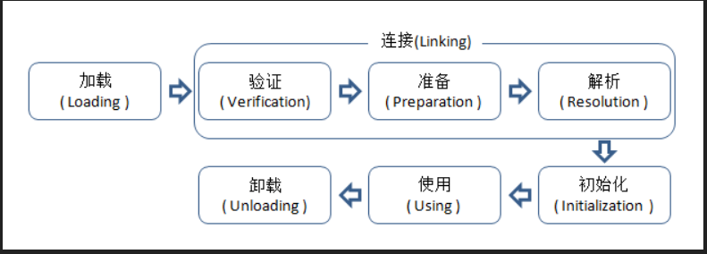

<!-- @import "[TOC]" {cmd="toc" depthFrom=1 depthTo=6 orderedList=false} -->
<!-- code_chunk_output -->

* [1. 类加载](#1-类加载)
	* [1.1 加载](#11-加载)
	* [1.2 验证](#12-验证)
	* [1.3 准备](#13-准备)
	* [1.4 解析](#14-解析)
	* [1.5 初始化](#15-初始化)
		* [1.5.1 类的主动引用（一定发生初始化）](#151-类的主动引用一定发生初始化)
			* [初始化类型](#初始化类型)
			* [简而言之：](#简而言之)
		* [1.5.2 类的被动引用（不会发生类初始化）](#152-类的被动引用不会发生类初始化)
* [2. 类加载器](#2-类加载器)
	* [2.1 全盘委托](#21-全盘委托)
	* [2.2 双亲委派模型](#22-双亲委派模型)
	* [2.3 缓存机制](#23-缓存机制)

<!-- /code_chunk_output -->

# 1. 类加载
.java”文件经过Java编译器编译成拓展名为”.class”的文件，”.class”文件中保存着Java代码经转换后的虚拟机指令，当需要使用某个类时，虚拟机将会加载它的”.class”文件，并创建对应的class对象，将class文件加载到虚拟机的内存，这个过程称为类加载，如图所示：

## 1.1 加载
- 通过一个类的全限定名来获取定义此类的二进制字节流
	- 本地直接加载
	- 网络上下载
	- jar包，zip压缩包
	- java动态编译
- 将这个字节流所代表的静态存储结构转化为方法区的运行时数据结构；
- 在内存中生成一个代表这个类的java.lang.Class对象，作为方法区这个类的各种数据的访问入口
## 1.2 验证
为了确保Class文件的字节流中包含的信息符合当前虚拟机的要求，并且不会危害虚拟机自身的安全
- 虚拟机验证：验证输入字节流是否符合Class文件存储格式，否则抛出VertifyError
- 文件格式验证：验证字节流是否符合Class文件格式的规范；此验证之后，字节流会进入内存的方法去进行存储。
- 元数据验证：对字节码描述的信息进行语义分析以保证其描述的信息符合Java语言规范的要求；
- 字节码验证：通过数据流和控制流分析，确定程序语义是合法的、符合逻辑的。
- 符号引用验证：确保解析动作能正确执行。
## 1.3 准备
准备是为**类变量分配内存**，**类变量初始值**的阶段，这些变量所使用的内存都将在方法区中进行分配。这时候进行内存分配的仅包括**类变量（被static修饰的变量）**，而不包括实例变量，实例变量将会在对象实例化时随着对象一起分配在堆中。其次，这里所说的初始值“通常情况”下是数据类型的零值，假设一个类变量的定义为：
```java
public static int value1=123;  
public static final int value2=123;  
```
那变量value1在准备阶段过后的初始值为0而不是123，因为这时候尚未开始执行任何java方法，而把value赋值为123的putstatic指令是程序被编译后，存放于类构造器()方法之中，value赋值为123的动作将在**初始化阶段**才会执行。
至于value2即当类字段的字段属性是ConstantValue时，会在准备阶段初始化为指定的值，标注为final之后，value的值在准备阶段初始化为123而非0。
## 1.4 解析
解析阶段是虚拟机将常量池内的符号引用替换为直接引用的过程。解析动作主要针对类或接口、字段、类方法、接口方法、方法类型、方法句柄和调用点限定符7类符号引用进行。
## 1.5 初始化
### 1.5.1 类的主动引用（一定发生初始化）
#### 初始化类型
-	遇到new,getstatic,putstatic,invokestatic这失调字节码指令时，如果类没有进行过初始化，则需要先触发其初始化。生成这4条指令的最常见的Java代码场景是：使用new关键字实例化对象的时候、读取或设置一个类的静态字段（被final修饰、已在编译器把结果放入常量池的静态字段除外）的时候，以及调用一个类的静态方法的时候。
- 使用java.lang.reflect包的方法对类进行反射调用的时候，如果类没有进行过初始化，则需要先触发其初始化。反射生成对象的两种方式：
	- 使用Class对象的newInstance()方法创建Class对象对应类的实例，必须有默认的构造方法，newInstance本质上就是利用默认的构造方法创建实例
	- 先使用Class对象获取指定的Constructor对象，在调用Constructor对象的newInstance()来创建Class对象对应的实例，可以指定相应的构造方法来实例化对象；
- 当初始化一个类的时候，如果发现其父类还没有进行过初始化，则需要**先触发其父类的初始化**。
- 当虚拟机启动时，指定一个要执行的主类（包含main()方法的那个类），虚拟机会先初始化这个主类。
- 当使用jdk1.7动态语言支持时，如果一个java.lang.invoke.MethodHandle实例最后的解析结果REF_getstatic,REF_putstatic,REF_invokeStatic的方法句柄，并且这个方法句柄所对应的类没有进行初始化，则需要先出触发其初始化。
#### 简而言之：
- new一个对象
- 调用类的静态变量（final除外）和静态方法
- 反射
- 用户指定的类
- 先初始化父类
### 1.5.2 类的被动引用（不会发生类初始化）
- 访问静态域时，只有真正声明这个域的类的才会初始化
- 子类访问父类的静态变量，子类不会初始化
- 数组类引用，不会触发类的初始化
- 引用常量不会触发初始化，因为在编译期间存在常量池中
# 2. 类加载器
## 2.1 全盘委托
一个类的类加载器加载某个Class时，会把该Class所依赖的其他Class也由该类的类加载器负责加载
## 2.2 双亲委派模型
黑客自定义一个java.lang.String类，该String类具有系统的String类一样的功能，只是在某个函数稍作修改。比如equals函数，这个函数经常使用，如果在这这个函数中，黑客加入一些“病毒代码”。并且通过自定义类加载器加入到JVM中。此时，如果没有双亲委派模型，那么JVM就可能误以为黑客自定义的java.lang.String类是系统的String类，导致“病毒代码”被执行。
## 2.3 缓存机制
所有加载过的Class都被缓存，先去缓存区找，如果没有，去读取类的二进制文件，转换成Class对象
