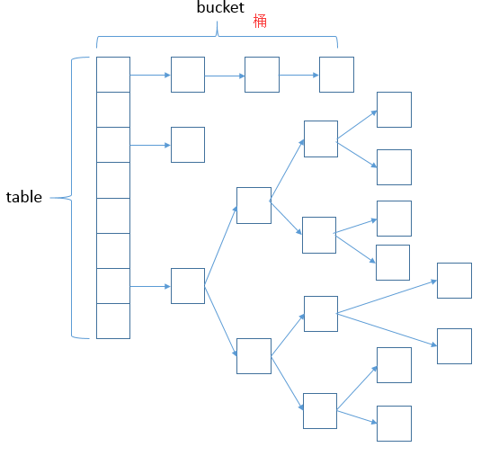

<!-- @import "[TOC]" {cmd="toc" depthFrom=1 depthTo=6 orderedList=false} -->
<!-- code_chunk_output -->

* [实现原理](#实现原理)
* [源码分析](#源码分析)
	* [hash算法](#hash算法)
	* [put方法](#put方法)
		* [流程：](#流程)
	* [get方法](#get方法)
	* [resize方法](#resize方法)
* [红黑树为什么提高效率？](#红黑树为什么提高效率)
* [求下标为什么是h&(length-1)而不是其他？为什么是2的幂？](#求下标为什么是hlength-1而不是其他为什么是2的幂)
* [多线程操作HashMap时出现什么问题](#多线程操作hashmap时出现什么问题)
* [参考](#参考)

<!-- /code_chunk_output -->

# 实现原理
数组（桶）+链表+红黑树：当链表的长度大于8时，存储桶中的存储方式变成红黑树，
[红黑树的引入是为了提高效率](#红黑树为什么提高效率)。

# 源码分析
    继承AbstractMap<K,V>，实现了Map<K,V>, Cloneable, Serializable接口
    默认容量 1<<4 == 16
    最大容量 1<<30
    负载因子 0.75
    变红黑树 8
## hash算法
```java
static final int hash(Object key) {
    int h;
    return (key == null) ? 0 : (h = key.hashCode()) ^ (h >>> 16);
}
```
如果key为null，返回key=0；否则如下图

## put方法
实际调用putVal()方法：
```java
public V put(K key, V value) {
    return putVal(hash(key), key, value, false, true);  
}
```

1. 判断键值对数组table[i]是否为空或为null，否则执行resize()进行扩容；
2. 根据键值key计算hash值得到插入的数组索引i，如果table[i]==null，直接新建节点添加，转向⑥，如果table[i]不为空，转向3；
3. 判断table[i]的首个元素是否和key一样，如果相同直接覆盖value，否则转向4，这里的相同指的是hashCode以及equals；
4. 判断table[i] 是否为treeNode，即table[i] 是否是红黑树，如果是红黑树，则直接在树中插入键值对，否则转向5；
5. 遍历table[i]，判断链表长度是否大于8，大于8的话把链表转换为红黑树，在红黑树中执行插入操作，否则进行链表的插入操作；遍历过程中若发现key已经存在直接覆盖value即可；
6. 插入成功后，判断实际存在的键值对数量size是否超多了最大容量threshold，如果超过，进行扩容。

```java
final V putVal(int hash, K key, V value, boolean onlyIfAbsent, boolean evict) {
    Node<K,V>[] tab; Node<K,V> p; int n, i;
    // 步骤1：tab为空则创建
    // table未初始化或者长度为0，进行扩容
    if ((tab = table) == null || (n = tab.length) == 0)
        n = (tab = resize()).length;
    // 步骤2：计算index，并对null做处理  
    // (n - 1) & hash 确定元素存放在哪个桶中，桶为空，新生成结点放入桶中(此时，这个结点是放在数组中)
    if ((p = tab[i = (n - 1) & hash]) == null)
        tab[i] = newNode(hash, key, value, null);
    // 桶中已经存在元素
    else {
        Node<K,V> e; K k;
        // 步骤3：节点key存在，直接覆盖value
        // 比较桶中第一个元素(数组中的结点)的hash值相等，key相等
        if (p.hash == hash &&
            ((k = p.key) == key || (key != null && key.equals(k))))
                // 将第一个元素赋值给e，用e来记录
                e = p;
        // 步骤4：判断该链为红黑树
        // hash值不相等，即key不相等；为红黑树结点
        else if (p instanceof TreeNode)
            // 放入树中
            e = ((TreeNode<K,V>)p).putTreeVal(this, tab, hash, key, value);
        // 步骤5：该链为链表
        // 为链表结点
        else {
            // 在链表最末插入结点
            for (int binCount = 0; ; ++binCount) {
                // 到达链表的尾部
                if ((e = p.next) == null) {
                    // 在尾部插入新结点
                    p.next = newNode(hash, key, value, null);
                    // 结点数量达到阈值，转化为红黑树
                    if (binCount >= TREEIFY_THRESHOLD - 1) // -1 for 1st
                        treeifyBin(tab, hash);
                    // 跳出循环
                    break;
                }
                // 判断链表中结点的key值与插入的元素的key值是否相等
                if (e.hash == hash &&
                    ((k = e.key) == key || (key != null && key.equals(k))))
                    // 相等，跳出循环
                    break;
                // 用于遍历桶中的链表，与前面的e = p.next组合，可以遍历链表
                p = e;
            }
        }
        // 表示在桶中找到key值、hash值与插入元素相等的结点
        if (e != null) {
            // 记录e的value
            V oldValue = e.value;
            // onlyIfAbsent为false或者旧值为null
            if (!onlyIfAbsent || oldValue == null)
                //用新值替换旧值
                e.value = value;
            // 访问后回调
            afterNodeAccess(e);
            // 返回旧值
            return oldValue;
        }
    }
    // 结构性修改
    ++modCount;
    // 步骤6：超过最大容量 就扩容
    // 实际大小大于阈值则扩容
    if (++size > threshold)
        resize();
    // 插入后回调
    afterNodeInsertion(evict);
    return null;
}
```

### 流程：
1. 根据key计算得到key.hash = (h = k.hashCode()) ^ (h >>> 16)；
2. 根据key.hash计算得到桶数组的索引index = key.hash & (table.length - 1),这样就找到该key的存放位置了：
  1). 如果该位置没有数据，用该数据新生成一个节点保存新数据，返回null；
  2). 如果该位置有数据是一个红黑树，那么执行相应的插入 / 更新操作；
  3). 如果该位置有数据是一个链表，分两种情况一是该链表没有这个节点，另一个是该链表上有这个节点，注意这里判断的依据是key.hash是否一样：
3. 如果该链表没有这个节点，那么采用尾插法新增节点保存新数据，返回null；如果该链表已经有这个节点了，那么找到该节点并更新新数据，返回老数据。
## get方法
实际调用方法为getNode方法
```java
public V get(Object key) {
    Node<k,v> e;
    return (e = getNode(hash(key), key)) == null ? null : e.value;
}
```

```java
final Node<K,V> getNode(int hash, Object key) {
    Node<K,V>[] tab; Node<K,V> first, e; int n; K k;
    // table已经初始化，长度大于0，根据hash寻找table中的项也不为空
    if ((tab = table) != null && (n = tab.length) > 0 &&
        (first = tab[(n - 1) & hash]) != null) {
        // 桶中第一项(数组元素)相等
        if (first.hash == hash && // always check first node
            ((k = first.key) == key || (key != null && key.equals(k))))
            return first;
        // 桶中不止一个结点
        if ((e = first.next) != null) {
            // 为红黑树结点
            if (first instanceof TreeNode)
                // 在红黑树中查找
                return ((TreeNode<K,V>)first).getTreeNode(hash, key);
            // 否则，在链表中查找
            do {
                if (e.hash == hash &&
                    ((k = e.key) == key || (key != null && key.equals(k))))
                    return e;
            } while ((e = e.next) != null);
        }
    }
    return null;
}
```
## resize方法

# 红黑树为什么提高效率？
# 求下标为什么是h&(length-1)而不是其他？为什么是2的幂？
h&(length - 1)，这句话除了上面的取模运算外还有一个非常重要的责任：均匀分布table数据和充分利用空间。

# 多线程操作HashMap时出现什么问题
# 参考
[HashMap的实现原理](https://blog.csdn.net/qq_27093465/article/details/52207152)
