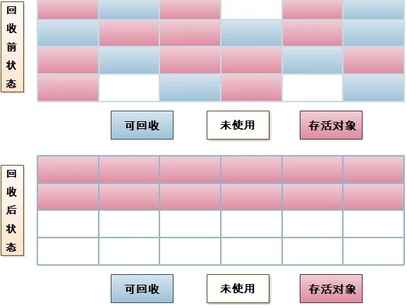

<!-- @import "[TOC]" {cmd="toc" depthFrom=1 depthTo=6 orderedList=false} -->
<!-- code_chunk_output -->

* [JVM内存模型](#jvm内存模型)
* [垃圾回收](#垃圾回收)
	* [内存分配](#内存分配)
		* [年轻代](#年轻代)
		* [老年代](#老年代)
	* [对象晋升](#对象晋升)
	* [对象生死判定](#对象生死判定)
		* [可达性分析算法](#可达性分析算法)
	* [分代收集](#分代收集)
		* [新生代-复制算法](#新生代-复制算法)
		* [老年代-标记清除算法](#老年代-标记清除算法)
		* [老年代-标记整理算法](#老年代-标记整理算法)
		* [永久代-方法区回收](#永久代-方法区回收)
* [垃圾回收器](#垃圾回收器)
* [#](#)
* [参考](#参考)

<!-- /code_chunk_output -->

# JVM内存模型
 
1. 程序计数器：_**线程私有**_
  - 程序计数器是一块较小的内存空间，它的作用可以看作是当前线程所执行的字节码的行号指示器。
  - 多线程是通过线程轮流切换并分配处理器执行时间实现，每条线程都需要有一个独立的程序计数器，各个线程之间的计数器互不影响，独立存储
  - 注：线程正在执行普通方法，计数器记录正在执行的虚拟机字节码指令的地址：如果正在执行的是Native方法，计数器值则为空
  - 注：唯一没有任何OutOfMemoryError的区域。
2. Java虚拟机栈：_**线程私有**_
  - Java方法执行的内存模型：每个方法被执行的时候都会同时创建一个栈帧，用于存储局部变量表、操作栈、动态链接、方法出口
  - 方法被调用直至执行完成，就对应着一个栈帧从入栈到出栈的过程。
  - 局部变量表存放了基本数据类型、对象引用（可能是一个指向对象起始地址的引用指针）和returnAddress类型(指向一条字节码指令的地址)。
  - 局部变量表所需的内存空间在编译期间完成分配，在方法运行期间不会改变局部变量表的大小。
  - Java虚拟器规范中，栈不够了，**将抛出StackOverflowError异常**；当扩展时无法申请到足够的内存时会**抛出OutOfMemoryError异常**。
3. 本地方法栈：_**线程私有**_
- 本地方法栈是为虚拟机使用到的Native方法服务的。本地方法栈也会**抛出StackOverflowError和OutOfMemoryError异常。**
4. Java堆：**线程共享**
  - 在虚拟机启动时创建。唯一目的就是存放对象实例。
  - Java虚拟机规范规定：所有的对象实例以及数组都要在堆上分配。
  - Java堆是垃圾收集器管理的主要区域，因此很多时候也被称为“GC堆”
  - 当前驻留的虚拟机都是按照可扩展来实现的（通过-Xmx 和 -Xms控制），**将会抛出OutOfMemoryError异常。**
5. **方法区：线程共享**
  - 存储已被虚拟机加载的**类信息、常量、静态变量**、即时编译器编译后的代码等数据。
  - Java虚拟机规范规定，当方法区无法满足内存分配需求时，**将抛出OutOfMemoryError异常。**
6. 运行时常量池
  - 运行时常量池（Runtime Constant Pool）是方法区的一部分。Class文件中除了有类的版本、字段、方法、接口等描述信息外，还有一项信息是常量池（Constant Pool Table），用于存放编译期生成的各种字面量和符号引用。这部分内容将在类加载后存放到方法区的运行时常量池中。
  - 运行时常量池相对于Class文件常量池的另外一个重要特征是具备动态性，不仅Class文件中的常量池的内容可以进入方法去运行时常量池，运行期间也可能将新的常量放入池中。
# 垃圾回收
java中垃圾回收有jvm自行处理，以守护线程的方式运行，程序员无需调用垃圾回收方法。
## 内存分配
java堆中可分为年轻代，老年代，持久代；
### 年轻代
一个伊甸园（eden），两个存活区（survivor）
- minor GC：
  - 先将eden区存活对象复制到一个survivor0区，然后清空eden区，
  - 当个survivor0区也存放满了时，则将eden区和survivor0区存活对象复制到另一个survivor1区，然后清空eden和这个survivor0区，
  - 此时survivor0区是空的，然后将survivor0区和survivor1区交换，即保持survivor1区为空， 如此往复。
  - 当survivor1区不足以存放 eden和survivor0的存活对象时，就将存活对象直接存放到老年代。若是老年代也满了就会**触发一次Full GC**，也就是新生代、老年代都进行回收
### 老年代
在年轻代进行N次垃圾回收之后仍然活着的对象，进入老年代，当老年代内存满了触发一次Full GC，Full GC发生频率比较低，老年代对象存活时间比较长，存活率标记高
## 对象晋升
- 年龄阈值
VM为每个对象定义了一个对象年龄(Age)计数器, 对象在Eden出生如果**经第一次Minor GC**后仍然存活, 且能被Survivor容纳的话, 将被移动到Survivor空间中, 并将年龄设为1. **以后对象在Survivor区中每熬过一次Minor GC年龄就+1**. 当增加到一定程度(**-XX:MaxTenuringThreshold, 默认15**), 将会晋升到老年代.
- 提前晋升: 动态年龄判定
然而VM并不总是要求对象的年龄必须达到MaxTenuringThreshold才能晋升老年代:**_如果在Survivor空间中相同年龄所有对象大小的总和大于Survivor空间的一半, 年龄大于或等于该年龄的对象就可以直接进入老年代_**, 而无须等到晋升年龄.

## 对象生死判定
### 可达性分析算法
通过一系列的称为 GC Roots 的对象作为起点, 然后向下搜索; 搜索所走过的路径称为引用链/Reference Chain, 当一个对象到 GC Roots 没有任何引用链相连时, 即该对象不可达, 也就说明此对象是不可用的,

- 在Java, 可作为GC Roots的对象包括:
  - 方法区: **类静态属性**引用的对象;
  - 方法区: **常量引用**的对象;
  - 虚拟机栈(本地变量表)中引用的对象；
  - 本地方法栈JNI(Native方法)中引用的对象；
- 四种引用类型
	- **强引用**：对象被拥有即为强引用，垃圾回收器不收集这类的对象，宁可抛出OOM异常，也不会收集该类的对象来解决内存不足的问题。
	- **软引用**：只要内存足够，垃圾回收器就不会回收，内存不足是会收集所以软引用的对象
		- 可用来实现内存敏感的高速缓存，
		- 能防止内存泄露，增强程序的健壮性。
	- **弱引用**：有生命周期，可有可无的对象，gc扫描的时候会这种类型的对象全部收集
		- 如果弱引用所引用的对象被JVM回收，这个软引用就会被加入到与之关联的引用队列中。
	- **虚引用**：没有生命周期，引用形同虚设，必须和引用队列关联使用

## 分代收集
### 新生代-复制算法
该算法的核心是将可用内存按容量划**分为大小相等的两块, 每次只用其中一块, 当这一块的内存用完, 就将还存活的对象复制到另外一块上面, 然后把已使用过的内存空间一次清理掉.**

### 老年代-标记清除算法
该算法分为“标记”和“清除”两个阶段: 首先标记出所有需要回收的对象(可达性分析), 在标记完成后统一清理掉所有被标记的对象.

1. 效率问题: 标记和清除过程的**效率都不高**;
2. 空间问题: 标记清除后会**产生大量不连续的内存碎片**, 空间碎片太多可能会导致在运行过程中需要分配较大对象时无法找到足够的连续内存而不得不提前触发另一次垃圾收集.
### 老年代-标记整理算法

该算法会有以下两个问题:

### 永久代-方法区回收
主要回收两部分内容: 废弃常量和无用的类. 回收废弃常量与回收其他年代中的对象类似, 但要判断一个类是否无用则条件相当苛刻:
1. 该类所有的实例都已经被回收, Java堆中不存在该类的任何实例;
2. 该类对应的Class对象没有在任何地方被引用(也就是在任何地方都无法通过反射访问该类的方法);
3. 加载该类的ClassLoader已经被回收.
# 垃圾回收器
##
# 参考
[JVM初探：内存分配、GC原理与垃圾收集器](http://www.importnew.com/23035.html)
[深入理解 Java 垃圾回收机制](https://www.cnblogs.com/andy-zcx/p/5522836.html)
