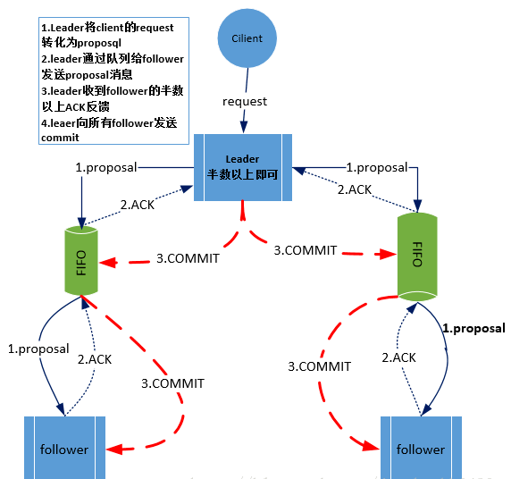
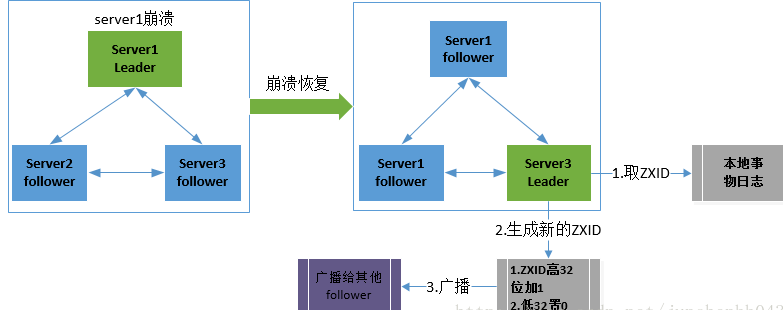

<!-- @import "[TOC]" {cmd="toc" depthFrom=1 depthTo=6 orderedList=false} -->
<!-- code_chunk_output -->

* [CAP理论](#cap理论)
* [一致性协议](#一致性数据库mysqlmd事务协议)
	* [2PC](#2pc)
		* [提交事务请求](#提交事务请求)
		* [执行事务提交](#执行事务提交)
		* [优缺点](#优缺点)
	* [3PC](#3pc)
		* [提交事务请求](#提交事务请求-1)
		* [事务预提交](#事务预提交)
		* [事务提交](#事务提交)
* [ZooKeeper](#zookeeper)
	* [ZAB协议（zookeeper原子广播协议）](#zab协议zookeeper原子广播协议)
			* [消息广播（基于FIFO的TCP协议）](#消息广播基于fifo的tcp协议)
			* [崩溃恢复](#崩溃恢复)
			* [数据同步](#数据同步)
		* [ZooKeeper如何保证分布式数据一致性？（面试题）](#zookeeper如何保证分布式数据一致性面试题)

<!-- /code_chunk_output -->
# CAP理论

一个分布式系统最多满足一致性（C），可用性（A）和分区容错性（P）的两个，但作为分布式系统而言，P是一个系统中最基本的要求，显然需要根据业务特点从A与C中选择来寻找平衡
# [一致性](/数据库/mysql.md#事务)协议
## 2PC
二阶段提交的要求协调者必须等到所有的参与者全部反馈ACK确认消息后，再发送commit消息。要求所有的参与者要么全部成功要么全部失败。二阶段提交会产生严重阻塞问题。
### 提交事务请求
- 事务询问
- 执行事务
- 参与想协调者反馈事务询问
  - 执行返回为yes
  - 不可以执行返回为no
### 执行事务提交
- 执行事务提交：参与者全部都是yes
  - 发送提交请求
  - 执行提交
  - 反馈提交结果
  - 完成提交
- 执行事务中断：任何一个反馈为no
  - 发送回滚请求
  - 回滚
  - 反馈回滚结果
  - 中断事务
### 优缺点
优点：简单，易实现
缺点：
- 单点问题：协调者只有一个
- 脑裂：可能只有部门参与者提交事务
- 同步阻塞：参与者等待其他参与者响应时，无法进行任何操作
- 保守：只能通过超时机制中断事务
## 3PC
### 提交事务请求
- 事务询问
- 参与想协调者反馈事务询问
  - 执行返回为yes
  - 不可以执行返回为no
### 事务预提交
- 执行事务预提交：参与者全部都是yes
  - 发送预提交请求
  - 执行预提交
  - 反馈提交结果
- 执行事务中断：任何一个反馈为no
  - 发送中断请求
  - 中断事务
### 事务提交
- 执行事务提交：参与者全部都是yes
  - 发送提交请求
  - 执行提交
  - 反馈提交结果
  - 完成提交
- 执行事务中断：任何一个反馈为no
  - 发送中断请求
  - 回滚
  - 反馈回滚结果
  - 中断事务
# ZooKeeper
## ZAB协议（zookeeper原子广播协议）
#### 消息广播（基于FIFO的TCP协议）
- 客户端发起一个写操作请求
- Leader服务器将客户端的请求转化为事务proposql提案，同时为每个proposal分配一个全局唯一的ID，即ZXID。
- leader服务器与每个follower之间都有一个队列，leader将消息发送到该队列
- follower机器从队列中取出消息处理完(写入本地事物日志中)毕后，向leader服务器发送ACK确认。
- leader服务器收到**半数以上**的follower的ACK后，即认为可以发送commit
- leader向所有的follower服务器发送commit消息。

#### 崩溃恢复
通过选举算法来保障leader宕机之后迅速选举出新的leader
- 选举zxid最大的机器作为leader
  - 确保该机器拥有最新的proposal，可以继续proposal提交
#### 数据同步
- 在zookeeper集群中新的leader选举成功之后，leader会将自身的提交的最大proposal的事物ZXID发送给其他的follower节点。follower节点会根据leader的消息进行回退或者是数据同步操作。最终目的要保证集群中所有节点的数据副本保持一致。

### ZooKeeper如何保证分布式数据一致性？（面试题）
基于ZAB协议。
