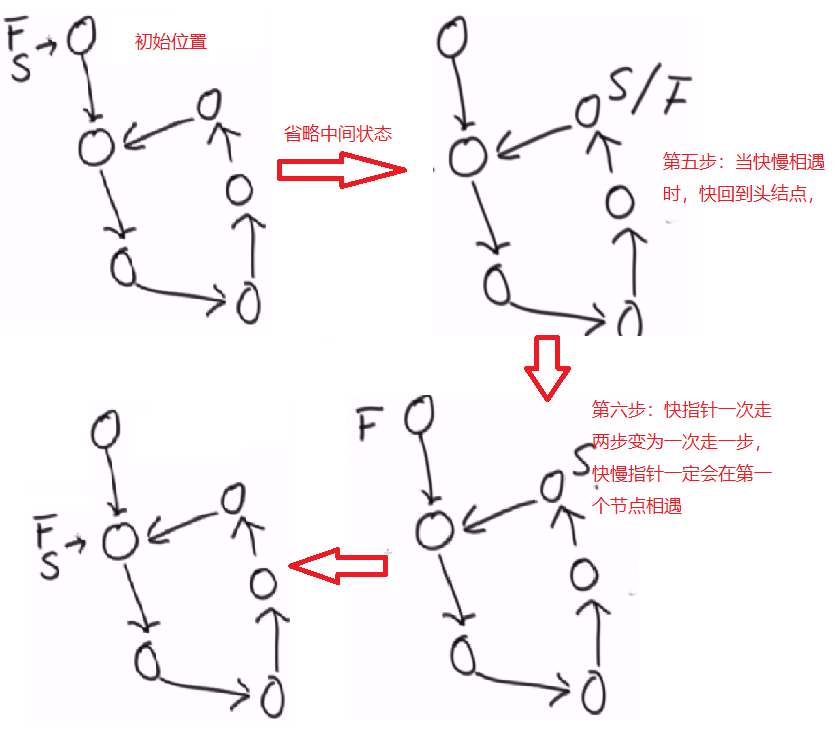

# 单链表反转
```java
public class Solution {
  public ListNode ReverseList(ListNode head) {
      if(head==null){
        return head;
      }
      ListNode pre = null;
      ListNode next = null;
      while(head!=null){           
        next = head.next;//1
        head.next = pre;//2
        pre = head;//3
        head = next;//4
      }
      return pre;
    }
  }
```
1. 先将head.next保存下来，保存为next
2. 反转时，需要将head.next为null，因为第一个节点head的前一个节点pre为null，因此，head.next = pre
3. 之后将head设为pre，等待下一个节点的前一个节点指向该pre
4. 将head设为next，重复之前得到动作。
  - 假设1->2->3->4->null;第一次循环head = 1;
    - next = head.next;即next为2；
    - head.next = pre;此时pre为null；
    - pre = head;pre为1
    - head = next;head为2；
  - pre指向1，head指向2，
  - 链表变为null<-1 2->3->4->null;null<-1<-2 3->4->null;最后完成反转

# 单链表的增加，删除
- 假设1->3->4->null
增加节点2
  ```java
    2.next = 1.next;
    1.next = 2;
  ```
- 假设1->2->3->4->null
删除节点2
  ```java
    1.next = 2.next
    delete 2;
  ```
# 单链表的相交问题
## 判断是否有环：如果有环返回入环的节点，如果没环返回为null
### 1. HashSet的方式，将每个节点放到HashSet中，遍历链表
### 2. 快慢指针
快一次两步，慢一次一步，快慢指针一定会在环上相遇

```java
public static Node getLoopNode(Node head) {
  if (head == null || head.next == null || head.next.next == null){
    return null;
  }
  Node slow = head.next; // 慢指针
  Node fast= head.next.next; // 快指针
  while (slow != fast) { // 1. 快慢指针相遇时跳出循环
    if (fast.next == null || fast.next.next == null) {
      return null;
    }
    fast = fast.next.next;
    slow = slow.next;
  }
  fast = head; // 2. 快指针回到开头
  while (slow != fast) { //3. 当快指针与慢指针再次相遇时，就是入环节点
    slow = slow.next;//快慢均走一步
    fast = fast.next;
  }
  return slow;
}
```
## 判断一个无环单链表是否相交
```java
public static Node noLoop(Node head1, Node head2) {
  if (head1 == null || head2 == null) {
    return null;
  }
  Node cur1 = head1;
  Node cur2 = head2;
  int n = 0;//表示两个链表的长度的差值
  while (cur1.next != null) {
    n++;
    cur1 = cur1.next;
  }
  while (cur2.next != null) {
    n--;
    cur2 = cur2.next;
  }
  //上面两个循环结束时，cur1和cur2均指向两个链表的最后一个节点
  // 如果cur1 != cur2，那么两个链表一定不相交
  if (cur1 != cur2) {
    return null;
  }
  cur1 = n > 0 ? head1 : head2;//判断哪个链表更长，cur1就是长的链表
  cur2 = cur1 == head1 ? head2 : head1;//cur2是短链表
  n = Math.abs(n);
  while (n != 0) {// 2.当n==0时
    n--;
    cur1 = cur1.next;// 1.让长的链表先走
  }
  // 3.当n==0时,连个一起走，当cur1与cur2相等时，即为链表的相同节点
  while (cur1 != cur2) {
    cur1 = cur1.next;
    cur2 = cur2.next;
  }
  return cur1;
}
```
## 判断两个有环单链表是否相交
