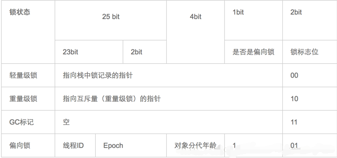

<!-- TOC depthFrom:1 depthTo:6 withLinks:1 updateOnSave:1 orderedList:0 -->

- [synchronized](#synchronized)
	- [Java对象头和Moniter](#java对象头和moniter)
		- [对象头](#对象头)
			- [同步代码块](#同步代码块)
			- [同步方法](#同步方法)
		- [可重入性](#可重入性)
	- [synchronized优化](#synchronized优化)
		- [偏向锁](#偏向锁)
		- [轻量级锁](#轻量级锁)
		- [自旋锁](#自旋锁)
- [Lock](#lock)
	- [ReentrantLock](#reentrantlock)
- [区别](#区别)

<!-- /TOC -->
# synchronized
通过JVM进入和退出Monitor对象来实现方法同步和代码块同步
- 方法同步：读取运行时常量池中方法的 ACC_SYNCHRONIZED 标志来隐式实现的
- 代码块同步：使用monitorenter和moniterexit指令实现，

## Java对象头和Moniter
java中一个对象在内存中包含三块区域：对象头，实例数据，填充数据

### 对象头
synchronized使用的锁对象是存储在Java对象头里的，jvm中采用2个字来存储对象头(如果对象是数组则会分配3个字，多出来的1个字记录的是数组长度)
其中Mark Word在默认情况下存储着对象的HashCode（25bit）、分代年龄（4bit）、锁标记位（2bit），是否为偏向锁（1bit）等以下是32位JVM的Mark Word默认存储结构。


synchronized的对象锁指针指向的是monitor对象的起始地址。每个对象都存在着一个 monitor 与之关联，对象与其 monitor 之间的关系有存在多种实现方式，如monitor可以与对象一起创建销毁或当线程试图获取对象锁时自动生成，但当一个 monitor 被某个线程持有后，它便处于锁定状态。

#### 同步代码块
通过**字节码指令**来控制，执行同步代码块后首先要先执行monitorenter指令，退出的时候monitorexit指令。通过分析之后可以看出，使用Synchronized进行同步，其关键就是必须要对对象的监视器monitor进行获取，当线程获取monitor后才能继续往下执行，否则就只能等待。
- 当 objectref 的 monitor 的进入计数器为 0，那线程可以成功取得 monitor，并将计数器值设置为 1，取锁成功。
  - 当前线程已经拥有 objectref 的 monitor 的持有权，那它可以重入这个 monitor (关于[重入性](#可重入性)稍后会分析)，**重入时计数器的值也会加 1**
- 正在执行线程执行完毕，即monitorexit指令被执行，执行线程将释放 monitor(锁)并设置计数器值为0 ，其他线程将有机会持有 monitor 。

#### 同步方法
方法级的同步是隐式，它实现在方法调用和返回操作之中。JVM可以从方法常量池中的方法表结构(method_info Structure) 中的 ACC_SYNCHRONIZED 访问标志区分一个方法是否同步方法。

### 可重入性
```java
public class SynchronizedDemo {
    public static void main(String[] args) {
        //this,当前实例对象锁
        synchronized (this) {
            method();//synchronized的可重入性
        }

    }
    private synchronized  static void method() {
    }
}
```
在获取当前实例对象锁后进入synchronized代码块执行同步代码，并在代码块中调用了当前实例对象的另外一个synchronized方法，再次请求当前实例锁时，将被允许，进而执行方法体代码，这就是**重入锁**最直接的体现，需要特别注意另外一种情况，**当子类继承父类时，子类也是可以通过可重入锁调用父类的同步方法**。注意由于synchronized是基于monitor实现的，因此每次重入，monitor中的计数器仍会加1。

## synchronized优化

### 偏向锁
- 当一个线程访问同步块并获取锁时，会在**对象头和栈帧中**的锁记录里存储锁偏向的线程ID，以后该线程在进入和退出同步块时不需要进行CAS操作来加锁和解锁，
- 偏向锁使用了一种等到竞争出现才释放锁的机制，所以当其他线程尝试竞争偏向锁时，持有偏向锁的线程才会释放锁。

### 轻量级锁

### 自旋锁
- 自旋锁可以使线程在没有取得锁的时候，不被挂起，而转去执行一个空循环，（即所谓的自旋，就是自己执行空循环），若在若干个空循环后，线程如果可以获得锁，则继续执行。若线程依然不能获得锁，才会被挂起。
- 使用自旋锁后，线程被挂起的几率相对减少，线程执行的连贯性相对加强。因此，对于那些锁竞争不是很激烈，锁占用时间很短的并发线程，具有一定的积极意义，但对于锁竞争激烈，单线程锁占用很长时间的并发程序，自旋锁在自旋等待后，往往毅然无法获得对应的锁，

# Lock
是个接口，可以显示的去进行加锁与释放锁的操作，lock()方法加锁，unlock释放锁

## ReentrantLock
其实现都依赖java.util.concurrent.AbstractQueuedSynchronizer类，AbstractQueuedSynchronizer会把所有的请求线程构成一个CLH队列，当一个线程执行完毕（lock.unlock()）时会激活自己的后继节点，但正在执行的线程并不在队列中，而那些等待执行的线程全部处于阻塞状态，

# 区别
|类型|synchronized|Lock|
|:-:| :------------------------------------: | :-: |
|存在层次|Java的关键字，在jvm层面上|是一个接口|
|锁的释放|1、以获取锁的线程执行完同步代码，释放锁 2、线程执行发生异常，jvm会让线程释放锁|在finally中必须释放锁，不然容易造成线程死锁|
|锁的获取|假设A线程获得锁，B线程等待。如果A线程阻塞，B线程会一直等待|分情况而定，Lock有多个锁获取的方式，具体下面会说道，大致就是可以尝试获得锁，线程可以不用一直等待|
|锁的状态|无法判断|可以判断|
|锁类型|可重入 不可中断 非公平|可重入 可判断 可公平（两者皆可）|
|性能|少量同步|大量同步|
